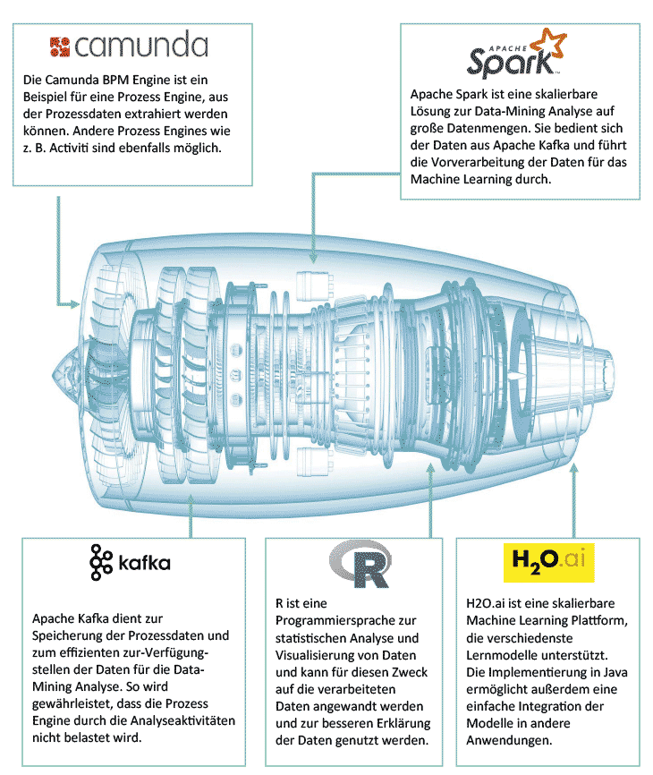
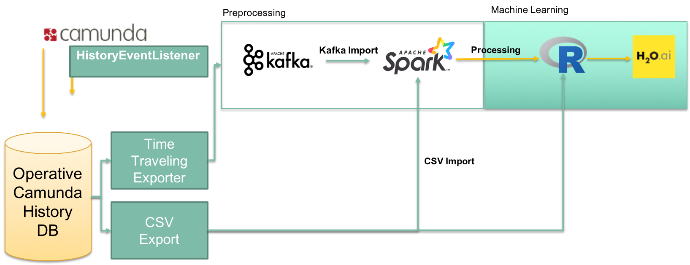

# BPMN.AI

 

*Read this in other languages: [English](README.en.md), [German](README.md).*

Bpmn.ai bezeichnet den Ansatz, Standard-Prozessdaten für ein Data Mining aufzubereiten und zu nutzen. Bpmn.ai umfasst die gesamte Pipeline von der Datenextraktion, über die Transformation und Aufarbeitung der Daten, bis hin zum Anlernen eines geeigneten Machine Learning Algorithmus und dem zur Verfügung stellen, der daraus gewonnen Erkenntnisse.
Diese können unter anderem zur Optimierung und Automatisierung von Prozessen verwendet werden, sind aber generell für verschiedenste Anwendungen interessant (z.B.
Engpassanalysen, Prozessdauervorhersagen).

Daraus ergibt sich das folgende Gesamtbild einer Java-fokussierten KI-Infrastruktur [bpmn.ai](https://www.viadee.de/bpmnai), die sich sehr leicht aufsetzen und auch mit großen Datenmengen betreiben lässt:

In diesem Repository enthalten ist die (konfigurierbare) Datenaufbereitungs-Pipeline mittels Apache Spark. Oft sind 80% des Aufwands eines Data-Mining-Projektes geprägt durch Datenaufbereitung: Wenn die Datenquelle "bekannt" ist, kann hier viel wiederverwendet werden und alle profitieren von der Weiterentwicklung.

# Zusammenarbeit

Das Projekt wird betrieben und weiterentwickelt von der viadee Unternehmensberatung GmbH in Münster, Westfalen. Ergebnisse aus Abschlussarbeiten an der WWU Münster und der FH Münster sind eingeflossen.

* Weitere Abschlussarbeiten sind geplant: Ansprechpartner dazu ist Dr. Frank Köhne von der viadee.
* Community-Beiträge zum Projekt sind gern gesehen: Hierzu bitten wir Github-Issues mit Vorschägen (oder PR) zu öffnen, die wir dann im Team bearbeiten können.
* Außerdem suchen wir nach weiteren Partnern, die interessante Prozessdaten für die Erprobung des Toolings haben oder auch einfach Interesse an einer Diskussion rund um KI in der Geschäftsprozessautomatisierung.

# Roadmap
Aktuell sammeln wir Feedback und priorisieren Ideen für die Weiterentwicklung. Abzusehen ist aber schon:
* Das bpmn.ai-Tooling soll einfacher zugänglich, anschaulicher werden.
* Wir planen Ansätze aus der Explainable AI (XAI) wie bspw. [Anchors](https://github.com/viadee/javaAnchorExplainer) in den Anwendungsprozess zu integieren.

# Komponenten

## spark-importer

Der Spark-Importer enthält drei Apache Spark-Anwendungen, die der Aufgabe dienen, Daten aus der Camunda-Engine zu übernehmen und sie in eine Data-Mining-Tabelle zu überführen, die eine Zeile pro Prozessinstanz mit zusätzlichen Spalten für jede Prozessvariable enthält. Diese Data-Mining-Tabelle wird dann verwendet, um einen Machine Learning Algorithmus zu trainieren, um bestimmte Ereignisse des Prozesses in der Zukunft vorherzusagen.
Für die folgenden Anwendungen stehen zur Verfügung:

* SparkImporterCSVApplication
* SparkImporterKafkaImportApplication
* SparkImporterKafkaDataProcessingApplication

Jede dieser Anwendungen erfüllt einen anderen Zweck.

Im Order [Tutorial](/tutorials) befinden sich Beispiele zu den Anwendungen.

### Datenpipeline

Die folgende Grafik zeigt die Pipeline, durch die die Daten von Camunda zur Machine Learning Engine fließen. Jede der drei Anwendungen dient einem bestimmten Zweck und Anwendungsfällen rund um den Import in, die Datenaggregation und -transformation innerhalb und den Export von Daten aus Apache Spark.

### SparkImporterCSVApplication

Diese Anwendung (Anwendungsklasse: CSVImportAndProcessingApplication) nimmt Daten aus einem CSV-Export von Camunda-History-Datenbanktabellen auf und aggregiert sie zu einer Data-Mining-Tabelle. Das Ergebnis ist auch eine CSV-Datei mit der Data-Mining-Tabellenstruktur.

### SparkImporterKafkaImportApplication

Diese Anwendung (Anwendungsklasse: KafkaImportApplication) ruft Daten von Kafka ab, in denen drei Warteschlangen zur Verfügung gestellt wurden und mit Daten aus dem History-Ereignishandler von Camunda gefüllt werden:

* processInstance: gefüllt mit Ereignissen auf der Ebene der Prozessinstanz
* activityInstance: gefüllt mit Ereignissen auf der Ebene der Activity-Instanz
* variableUpdate: gefüllt mit Ereignissen, die passieren, wenn eine Variable in irgendeiner Weise aktualisiert wird.

Die abgerufenen Daten werden dann an einem definierten Ort als Parkettdateien gespeichert. Es findet keine Datenverarbeitung durch diese Anwendung statt, da sie als Spark-Anwendung laufen kann, die ständig Daten aus Kafka-Streams empfängt.

### SparkImporterKafkaDataProcessingApplication

Diese Anwendung (Anwendungsklasse: SparkImporterKafkaDataProcessingApplication) ruft Daten aus einem Kafka-Import ab. Die Daten durchlaufen die gleichen Schritte wie in der CSV-Import- und Verarbeitungsanwendung, es ist nur eine separate Anwendung, da sie eine andere Eingabe als der CSV-Fall haben.
