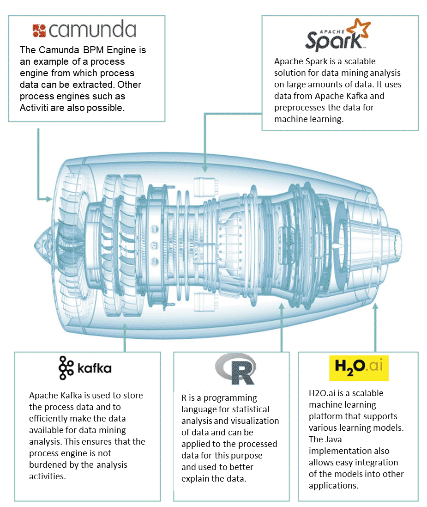

# BPMN.AI

*Read this in other languages: [English](README.md), [German](README.de.md).*

Bpmn.ai describes the approach of preparing and using standard process data for data mining. Bpmn.ai covers the entire pipeline, which means data extraction, transformation and processing of the data, learning a suitable machine learning algorithm and applying the knowledge gained in order to optimize or automate processes: Such process centric Machine Learning Models can be used for wide variety of applications such as e.g. bottleneck analyses, process duration predictions or anomaly detection.

This results in the following overall picture of a Java-focused AI infrastructure [bpmn.ai](https://www.viadee.de/bpmnai), which is very easy to set up and can also be used with large datasets:

This repository contains the (configurable) data preparation pipeline using Apache Spark. Oftentimes, 80% of the effort of a data mining project is spent on data preparation: If the data source is "known" beforehand and has a stable structure, a lot of things can be reused and everyone benefits from further development.

# Collaboration

The project is operated and further developed by the viadee Consulting AG in Münster, Westphalia. Results from theses at the WWU Münster and the FH Münster have been incorporated.

* Further theses are planned: Contact person is Dr. Frank Köhne from viadee.
* Community contributions to the project are welcome: Please open Github-Issues with suggestions (or PR), which we can then edit in the team.
* We are also looking for further partners who have interesting process data to refine our tooling as well as partners that are simply interested in a discussion about AI in the context of business process automation.

# Roadmap
We are currently collecting feedback and prioritising ideas for further development. We have already planned:
* The bpmn.ai-Tooling should become more accessible and more descriptive.
* We plan to integrate approaches from the Explainable AI (XAI) such as [Anchors](https://github.com/viadee/javaAnchorExplainer) into the application process.

# Components

## Spark-importer

The Spark Importer contains three Apache Spark applications that are used to translate data from the Camunda engine to a data mining table that consists of one row per process instance with additional columns for each process variable. This data mining table is then used to train a machine learning algorithm to predict certain future events of the process.
The following applications are available:

* CSVImportAndProcessingApplication
* KafkaImportApplication
* KafkaProcessingApplication

Each of these applications serves a different purpose.

Examples of the applications can be found in the [Wiki](/viadee/bpmn.ai/wiki/Tutorial-for-Spark-Importer/tutorials).

### Data pipeline

The following graphic shows the pipeline through which the data flows from Camunda to the Machine Learning engine. Each of the three applications serves a specific purpose and specific use cases concerning importing, aggregating and transforming data and exporting it from Apache Spark.

### CSVImportAndProcessingApplication

This application (class: CSVImportAndProcessingApplication) takes data from a CSV export of the Camunda history database tables and aggregates it to a data mining table. The result is also a CSV file of the data mining table structure.

### KafkaImportApplication

This application (class: KafkaImportApplication) retrieves data from Kafka in which three queues have been provided and filled with data from a Camunda history event handler:

* processInstance: filled with events at process instance level
* activityInstance: filled with events at activity instance level
* variableUpdate: filled with events that happen when a variable is updated in any way.

The data retrieved is then stored at a defined location as parquet files. There is no data processing by this application as it can run as a Spark application that constantly receives data from Kafka streams.

### KafkaProcessingApplication

This application (class: KafkaProcessingApplication) retrieves data from a Kafka import. The data goes through the same steps as in the CSV import and processing application, it is a separate application because it has a different input than the CSV case.
