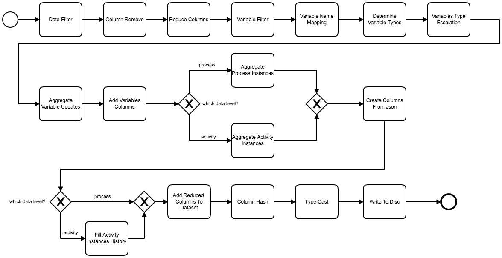

# viadee Spark BPMN process data importer details

This document describes the steps that are implemented in the Spark Importer application to get more in-depth understanding of the application.

## Data processing steps
When data runs through the processing, there are multiple steps involved. They differ in user configuration and generic processing steps and if the process or activity level is targeted for the processing. 

The graph shows the overall processing pipieline:


The following lists show the steps from top to bottom the data is passing through for each level:

### Process level

Step							| Step type
--------------------------|------------
[DataFilter](#datafilter-user-config)					| user config
[ColumnRemove](#columnremove-user-config)					| user config
[ReduceColumns](#reducecolumns-generic) 				| generic	 
[VariableFilter](#variablefilter-user-config)				| user config	 
[VariableNameMapping](#variablenamemapping-user-config)			| user config	
[DetermineVariableTypes](#determinevariabletypes-generic)   	| generic
[VariablesTypeEscalation](#variablestypeescalation-generic)		| generic
[AggregateVariableUpdates](#aggregatevariableupdates-generic)	| generic
[AddVariablesColumns](#addvariablescolumns-generic)			| generic
[AggregateProcessInstances](#aggregateprocessinstances-generic)	| generic
[CreateColumnsFromJson](#createcolumnsfromjson-generic)	| generic
[AddReducedColumnsToDataset](#addreducedcolumnstodataset-generic)	| generic
[ColumnHash](#columnhash-user-config) 			      	| user config
[TypeCast](#typecast-user-config) 			      	| user config
[MatchBrandsStep](#matchbrands-user-config)         | user config
[AddGeodataStep](#addgeodata-user-config)           | user config
[WriteToCSV](#writetocsv-generic)					| generic

### Activity level

Step							| Step type
--------------------------|------------
[DataFilter](#datafilter-user-config)					| user config
[ColumnRemove](#columnremove-user-config)					| user config
[ReduceColumns](#reducecolumns-generic) 				| generic	 
[VariableFilter](#variablefilter-user-config)				| user config	 
[VariableNameMapping](#variablenamemapping-user-config)			| user config	
[DetermineVariableTypes](#determinevariabletypes-generic)   	| generic
[VariablesTypeEscalation](#variablestypeescalation-generic)		| generic
[AggregateVariableUpdates](#aggregatevariableupdates-generic)	| generic
[AddVariablesColumns](#addvariablescolumns-generic)			| generic
[AggregateActivityInstances](#aggregateactivityinstances-generic)	| generic
[CreateColumnsFromJson](#createcolumnsfromjson-generic)	| generic	
[FillActivityInstancesHistory](#fillactivityinstanceshistory-generic)	| generic	
[AddReducedColumnsToDataset](#addreducedcolumnstodataset-generic)	| generic
[ColumnHash](#columnhash-user-config) 			      	| user config
[TypeCast](#typecast-user-config) 			      	| user config
[WriteToCSV](#writetocsv-generic)					| generic


Each step is now described in more detail and a (to a minimum reduced) example is used to better illustrate it.


### DataFilter (user config)
If the configuration contains a filter query (e.g. by limiting the processing only to one process definition id, it is applied in this step to reduce the input data.

As an example let's assume the following data is the input for this step:

processInstanceId  	| processDefinitionId | variableName  |  serializer | text | long |  double  |  revision
--------------------|---------------------|---------------|-------------|------|------|----------|----------
1						| p1                  | a             | string      | hello|      |          | 0
1						| p1                  | b             | boolean     |      | 1    |          | 1
1						| p1                  | c             | double      |      |      | 1.5      | 0
2						| p2                  | a             | string      | hi   |      |          | 0
2						| p2                  | b             | boolean     |      | 0    |          | 2
2						| p2                  | c             | double      |      |      | 12.5     | 1

Let's now assume the following filter query has been defined:

	processDefinitionId == 'p1'
	
The following dataset is then returned by this step:

processInstanceId  	| processDefinitionId | variableName  |  serializer | text | long |  double  |  revision
--------------------|---------------------|---------------|-------------|------|------|----------|----------
1						| p1                  | a             | string      | hello|      |          | 0
1						| p1                  | b             | boolean     |      | 1    |          | 1
1						| p1                  | c             | double      |      |      | 1.5      | 0

### ColumnRemove (user config)

In this step input columns are removed accoording to the configuration before the processing to the data is done.

As an example let's assume the following data is the input for this step:

processInstanceId  	| caseInstanceId      | variableName  |  serializer | text | long |  double  |  revision
--------------------|---------------------|---------------|-------------|------|------|----------|----------
1						| c1                  | a             | string      | hello|      |          | 0
1						| c1                  | b             | boolean     |      | 1    |          | 1
1						| c1                  | c             | double      |      |      | 1.5      | 0
2						| c2                  | a             | string      | hi   |      |          | 0
2						| c2                  | b             | boolean     |      | 0    |          | 2
2						| c2                  | c             | double      |      |      | 12.5     | 1


Let's assume the column caseInstanceId is configured to be removed. The following dataset is then returned by this step:

processInstanceId  	| variableName  |  serializer | text | long |  double  |  revision
--------------------|---------------|-------------|------|------|----------|----------
1						| a             | string      | hello|      |          | 0
1						| b             | boolean     |      | 1    |          | 1
1						| c             | double      |      |      | 1.5      | 0
2						| a             | string      | hi   |      |          | 0
2						| b             | boolean     |      | 0    |          | 2
2						| c             | double      |      |      | 12.5     | 1


### ReduceColumns (generic)
The columns of the input data is reduced to the minimum required for the processing to speed up the processing. The removed columns are added back in the end.

As an example let's assume the following data is the input for this step:

processInstanceId  	| processDefinitionId | variableName  |  serializer | text | long |  double  |  revision
--------------------|---------------------|---------------|-------------|------|------|----------|----------
1						| p1                  | a             | string      | hello|      |          | 0
1						| p1                  | b             | boolean     |      | 1    |          | 1
1						| p1                  | c             | double      |      |      | 1.5      | 0

The following dataset is then returned by this step:

processInstanceId  	| variableName  |  serializer | text | long |  double  |  revision
--------------------|---------------|-------------|------|------|----------|----------
1						| a             | string      | hello|      |          | 0
1						| b             | boolean     |      | 1    |          | 1
1						| c             | double      |      |      | 1.5      | 0

### VariableFilter (user config)
If the configuration contains variable that should not be processed then they are filtered out during this step.

As an example let's assume the following data is the input for this step:

processInstanceId  	| variableName  |  serializer | text | long |  double  |  revision
--------------------|---------------|-------------|------|------|----------|----------
1						| a             | string      | hello|      |          | 0
1						| b             | boolean     |      | 1    |          | 1
1						| c             | double      |      |      | 1.5      | 0

Let's now assume the following variable_configuration has been defined:

```json
	...
	"variable_configuration": [
		{
			"variable_name": "a",
			"variable_type": "string",
			"use_variable": true,
			"comment": ""
		},
		{
			"variable_name": "b",
			"variable_type": "boolean",
			"use_variable": false,
			"comment": ""
		},
		{
			"variable_name": "c",
			"variable_type": "double",
			"use_variable": true,
			"comment": ""
		}
	],
	...
```
	
The following dataset is then returned from this step:

processInstanceId  	| variableName  |  serializer | text | long |  double  |  revision
--------------------|---------------|-------------|------|------|----------|----------
1						| a             | string      | hello|      |          | 0
1						| c             | double      |      |      | 1.5      | 0

### VariableNameMapping (user config)
If a variable name changed (e.g. in a new process version) the user can configure a mapping in the configuration file so that they are handled as the same variable. These mappings are applied in this step.

As an example let's assume the following data is the input for this step:

processInstanceId  	| variableName  |  serializer | text | long |  double  |  revision
--------------------|---------------|-------------|------|------|----------|----------
1						| a             | string      | hello|      |          | 0
1						| b             | boolean     |      | 1    |          | 1
1						| c             | double      |      |      | 1.5      | 0
2						| f             | string      | hi   |      |          | 0
2						| b             | boolean     |      | 0    |          | 1
2						| c             | double      |      |      | 1.5      | 0

Let's now assume the following variable_configuration has been defined:

```json
	...
	"variable_name_mapping": [
      {
        "old_name": "a",
        "new_name": "f"
      }
    ],
    ...
```

	
The following dataset is then returned by this step:

processInstanceId  	| variableName  |  serializer | text | long |  double  |  revision
--------------------|---------------|-------------|------|------|----------|----------
1						| f             | string      | hello|      |          | 0
1						| b             | boolean     |      | 1    |          | 1
1						| c             | double      |      |      | 1.5      | 0
2						| f             | string      | hi   |      |          | 0
2						| b             | boolean     |      | 0    |          | 1
2						| c             | double      |      |      | 1.5      | 0

### DetermineVariableTypes (generic)
All process variables and their data types are detemined here.

As an example let's assume the following data is the input for this step:

processInstanceId  	| variableName  |  serializer | text | long |  double  |  revision
--------------------|---------------|-------------|------|------|----------|----------
1						| f             | string      | hello|      |          | 0
1						| b             | boolean     |      | 1    |          | 1
1						| c             | integer     |      | 1    |          | 0
2						| f             | string      | hi   |      |          | 0
2						| b             | boolean     |      | 0    |          | 1
2						| c             | double      |      |      | 1.5      | 0

Then the following internal table is created:

variable_name | variable_type
--------------|--------------
b             | boolean
c             | integer
c             | double
f             | string

	
The following unchanged dataset is returned by this step:

processInstanceId  	| variableName  |  serializer | text | long |  double  |  revision
--------------------|---------------|-------------|------|------|----------|----------
1						| f             | string      | hello|      |          | 0
1						| b             | boolean     |      | 1    |          | 1
1						| c             | integer     |      | 1    |          | 0
2						| f             | string      | hi   |      |          | 0
2						| b             | boolean     |      | 0    |          | 1
2						| c             | double      |      |      | 1.5      | 0


### VariablesTypeEscalation (generic)
This step uses data gathered from the last step. If a variable type changed (e.g. in a new process version from long to double) then it needs to be determined which type this variable should ultimately have. This is done in this step by escalalting the variable type to one that fits data from all types the variable had in the different process versions.

As an example let's assume the following internal table resulted from the last step:

variable_name | variable_type
--------------|--------------
b             | boolean
c             | integer
c             | double
f             | string

Then the following internal table is created:

variable_name | variable_type
--------------|--------------
b             | boolean
c             | double
f             | string

You see that the variable c was contained in the list twice, once with the type integer and once with the type double. The variable has been escalated to the type double to cater for all variable values.

The input dataset is returned unchanged by this step.

### AggregateVariableUpdates (generic)
This is the first aggregation step. In this step all variable updates are aggregated per process instance and variable. So if one variable value changed during a process instance it is aggregated to the last value the variable had in the process instance.

As an example let's assume the following data is the input for this step:

processInstanceId  	| variableName  |  serializer | text | long |  double  |  revision | variableUpdateTimestamp
--------------------|---------------|-------------|------|------|----------|-----------|-----------------------
1						| f             | string      | hello|      |          | 0         | 11000000
1						| b             | boolean     |      | 1    |          | 1         | 12000000
1						| c             | double      |      |      | 1.5      | 0         | 13000000
1						| c             | double      |      |      | 2.0      | 0         | 20000000
2						| f             | string      | hi   |      |          | 0         | 13000000
2						| b             | boolean     |      | 0    |          | 1         | 14000000
2						| c             | double      |      |      | 1.5      | 0         | 15000000

	
The following dataset is returned by this step:

processInstanceId  	| variableName  |  serializer | text | long |  double  |  revision | variableUpdateTimestamp
--------------------|---------------|-------------|------|------|----------|-----------|-----------------------
1						| f             | string      | hello|      |          | 0         | 11000000
1						| b             | boolean     |      | 1    |          | 1         | 12000000
1						| c             | double      |      |      | 2.0      | 0         | 20000000
2						| f             | string      | hi   |      |          | 0         | 13000000
2						| b             | boolean     |      | 0    |          | 1         | 14000000
2						| c             | double      |      |      | 1.5      | 0         | 15000000

### AddVariablesColumns (generic)
At this point we determined the last value of each variable for each process instance. Now for each variable a respective column is added and the data for each process instance is filled accordingly.

As an example let's assume the following data is the input for this step:

processInstanceId  	| variableName  |  serializer | text | long |  double  |  revision 
--------------------|---------------|-------------|------|------|----------|-----------
1						| f             | string      | hello|      |          | 0         
1						| b             | boolean     |      | 1    |          | 1         
1						| c             | double      |      |      | 2.0      | 0         
2						| f             | string      | hi   |      |          | 0         
2						| b             | boolean     |      | 0    |          | 1         
2						| c             | double      |      |      | 1.5      | 0         	
The following dataset is returned by this step (including revision columns):

processInstanceId   | f     | f_rev | b | b_rev | c | c_rev  
--------------------|-------|-------|---|-------|---|------
1						| hello | 0     |   |       |   |
1						|       |       | 1 | 1     |   |
1						|       |       |   |       |2.0| 0
2						| hi    | 0     |   |       |   |
2						|       |       | 0 | 1     |   |
2						|       |       |   |       |1.5| 0

### AggregateProcessInstances (generic)
In this step the data is aggregated in a way so that there is only one line per process instance in the dataset. In this step the process state for each process instance is also aggregated to the last state the process instance had in the underlying dataset.

As an example let's assume the following data is the input for this step:

processInstanceId   | f     | f_rev | b | b_rev | c | c_rev  
--------------------|-------|-------|---|-------|---|------
1						| hello | 0     |   |       |   |
1						|       |       | 1 | 1     |   |
1						|       |       |   |       |2.0| 0
2						| hi    | 0     |   |       |   |
2						|       |       | 0 | 1     |   |
2						|       |       |   |       |1.5| 0
    	
The following dataset is returned by this step:

processInstanceId   | f     | f_rev | b | b_rev | c | c_rev  
--------------------|-------|-------|---|-------|---|------
1						| hello | 0     | 1 | 1     |2.0| 0
2						| hi    | 0     | 0 | 1     |1.5| 0

### AggregateActivityInstances (generic)
In this step the data is aggregated in a way so that there is only one line per activity instance per process instance in the dataset.

As an example let's assume the following data is the input for this step:

processInstanceId   | activityInstanceId |  a     | b     | c
--------------------|--------------------|--------|-------|----
1						| a1                 | hans   |       | 
1						| a1                 |        |       | 14
1						| a2                 |        | 1     |
1						| a2                 |        |       | 16
2						| a1                 | klaus  |       | 
2						| a1                 |        |       | 5
2						| a2                 |        | 0     |
2						| a2                 |        |       | 8

The following dataset is returned by this step:

processInstanceId   | activityInstanceId |  a     | b     | c
--------------------|--------------------|--------|-------|----
1						| a1                 | hans   |       | 14
1						| a2                 |        | 1     | 16
2						| a1                 | klaus  |       | 5
2						| a2                 |        | 0     | 8

### CreateColumnsFromJson (generic)
In this step each variable column is checked if it contains a json and if so, the first level of attributes is transformed into separate columns. No object or array parameters are converted.

As an example let's assume the following data is the input for this step:

processInstanceId   | f     |  
--------------------|-------|
1						| {"name":"hans","age":30,"children":[{"name":"clara"},{"name":"joe"}]} |
2						| {"name":"klaus","age":34}      |

The following dataset is returned by this step:

processInstanceId   | f     | f_name  | f_age |
--------------------|-------|---------|-------|
1						| {"name":"hans","age":30,"children":[{"name":"clara"},{"name":"joe"}]} | hans | 30
2						| {"name":"klaus","age":34}      | klaus | 34


### FillActivityInstancesHistory (generic)
In this step each variable column is filled with values according to the history of the process instance up to the point of activity activity represented in the line. That means that not only the variables set at this activity are shown in each row but all variables that have been set or changed up until this activity in the according process instance in order to have the complete knowledge at this activity in the process instance.

As an example let's assume the following data is the input for this step where a1 happens before a2:

processInstanceId   | activityInstanceId |  a     | b
--------------------|--------------------|--------|-----
1						| a1                 | hans   | 
1						| a2                 |        | 1   
2						| a1                 | klaus  | 
2						| a2                 |        | 0   

The following dataset is returned by this step:

processInstanceId   | activityInstanceId |  a     | b
--------------------|--------------------|--------|-----
1						| a1                 | hans   | 
1						| a2                 | hans   | 1   
2						| a1                 | klaus  | 
2						| a2                 | klaus  | 0 

### AddReducedColumnsToDataset (generic)
In the beginning the non relevant columns where removed to speed up the processing. These columns are now added back to the dataset by using the processInstanceId as a reference.

As an example let's assume the following data is the input for this step:

processInstanceId   | f     | f_rev | b | b_rev | c | c_rev  
--------------------|-------|-------|---|-------|---|------
1						| hello | 0     | 1 | 1     |2.0| 0
2						| hi    | 0     | 0 | 1     |1.5| 0

Let's assume the column processDefinitioId has been removed in the beginning as it was in our exmaple. The following dataset is then returned by this step:

processInstanceId   | processDefinitioId | f     | f_rev | b | b_rev | c | c_rev  
--------------------|--------------------|-------|-------|---|-------|---|------
1						| p1                 | hello | 0     | 1 | 1     |2.0| 0
2						| p1                 | hi    | 0     | 0 | 1     |1.5| 0

### ColumnHash (user config)
In this step the columns that are configured to be hashed for anonymization are run through a SHA-1 hash operation.

As an example let's assume the following data is the input for this step:

processInstanceId   | processDefinitioId | f     | f_rev | b | b_rev | c | c_rev  
--------------------|--------------------|-------|-------|---|-------|---|------
1						| p1                 | hello | 0     | 1 | 1     |2.0| 0
2						| p1                 | hi    | 0     | 0 | 1     |1.5| 0

Let's assume the column f is configured to be hashed for anonymization. The following dataset is then returned by this step:

processInstanceId   | processDefinitioId | f     | f_rev | b | b_rev | c | c_rev  
--------------------|--------------------|-------|-------|---|-------|---|------
1						| p1                 | aaf4c61ddcc5e8a2dabede0f3b482cd9aea9434d | 0     | 1 | 1     |2.0| 0
2						| p1                 | c22b5f9178342609428d6f51b2c5af4c0bde6a42    | 0     | 0 | 1     |1.5| 0

### TypeCast (user config)
In this step the columns are casted into the data type they have been defined in the configuration. If the cast could not be done by Spark the value is null afterwards. The development feature --devtcc helps detecting these.

As an example let's assume the following data is the input for this step:

processInstanceId   | f     | f_rev | b | b_rev | c | c_rev  
--------------------|-------|-------|---|-------|---|------
1						| hello | 0     | 1 | 1     |2.0| 0
2						| hi    | 0     | 0 | 1     |1.5| 0

and the following variable config:

```json
	...
		{
			"variable_name": "b",
			"variable_type": "boolean",
			"use_variable": true,
			"comment": ""
		},
    ...
```


The following dataset is returned by this step:

processInstanceId   | f     | f_rev | b | b_rev | c | c_rev  
--------------------|-------|-------|---|-------|---|------
1						| hello | 0     | true | 1     |2.0| 0
2						| hi    | 0     | false | 1     |1.5| 0


### MatchBrands (user config)

In this step the column containing the car brands is processed. Two steps are applied for this purpose. On the one hand the data is compared with a list of car brands using the Levenshtein matching score and on the other hand manually created "regular expressions" are applied to the unassigned brands.
Levenshtein matching:

As an example let's assume the following data is the input for this step:

int_fahrzeugHerstellernameAusVertrag|
------------------------------------|
AUDI A1|
B-M-W|
MERCEDES-BENZ|
FORD/EUROPA|
VW|
CHRYSLER|

and the following brand matching table:

AUDI|
BMW|
MERCEDES|

and the following regular expression table

FORD | .*FORD.*
VOLKSWAGEN| .*VOLK.*|.*VW.*
MERCEDES | .*MERCE.*|.*MERZ.*|.*MB.*|.*DAIMLER.*|.*CHRYSLER.*|.*DC.*|DAIMLERC|.*DAIMLER.*|.*DB.*|.*BENZ.*

The following dataset is returned by this step:

int_fahrzeugHerstellernameAusVertrag|
------------------------------------|
AUDI|
BMW|
MERCEDES|
FORD|
VOLKSWAGEN|
MERCEDES|


### AddGeodata (user config)


### WriteToCSV (generic)
The resulting dataset is written into a CSV file. It could e.g. also be written to a HDFS filesystem.
